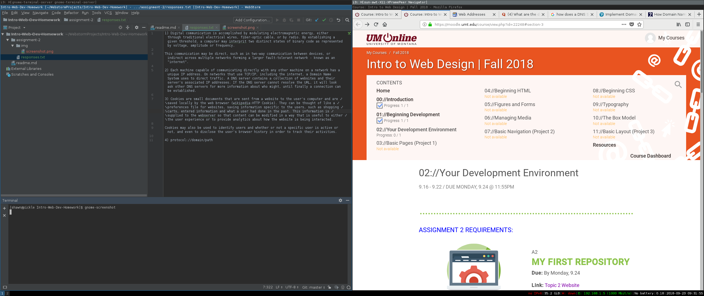

# Technical Report
## Shawn Kearney

### Version Control Systems
A version control system is a means to organize and track changes in projects in a way that is clear and organized, and can be easily reverted to previous states. VCS systems typically also include sophisticated collaboration features that allow changes to be submitted, approved and implemented. These features allow contributors to try different options without risking damage to the "master" project.

We use the GIT Version Control System to upload and share our code with others, and potentially get feedback and suggestions from other students and instructors. This allows us to learn collaboratively. GIT allows us to easily track progress and changes, merge changes when things break, and try different things as we learn. Lastly, GIT is an industry standard that can be difficult to wrap your head around. Even in this first moth of school I am aleady feeling more more comfortable using GIT, though I also understand that there is a lot still to learn about VCS.

### Assignment Responses

[responses.txt](responses.txt)

### Summary

This week went pretty smoothly. I did not encounter any problems. I don't think I made any real choices this week. I started by looking over the assignment and then went through the coursework. I then returned to the assignment and answered the specific questions. I used Wikipedia and Google Images to better understand DNS, though the whole process is still not totally clear to me. Often the internet is pictured as an indirect pathway with packages being forwarded on, however, I am also seeing graphics that would imply that communication is a "back and forth" topology, and information is accumulated by the ISP. I am a little confused which diagram is more accurate, or if I am missing some specific information.

### Screenshot

