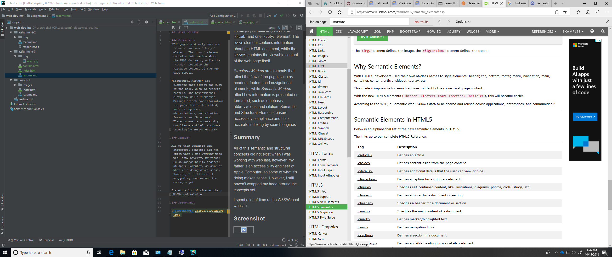

# Technical Report
## Shawn Kearney

### Discussion
HTML pages must only have one `<head>` and one `<body>` element. The `head` element contains information about the HTML document, while the `<body>` contains the viewable content of the web page itself.

*Structural Markup* are elements that affect the flow of the page, such as headers, footers, and navigational elements, while *Semantic Markup* affect how information is presented or formatted, such as emphasis, abbreviations, and citation. Semantic and Structural Elements ensure accessibity compliance and help accurate indexing by search engines.

### Summary

All of this semantic and structural concepts did not exist when I was working with web last, however, my father is an accessibility engineer at Apple Computer, so some of what it's doing makes sense. However, I still haven't wrapped my head around the concepts yet.

I spent a lot of time at the W3SWchool website.

### Screenshot

