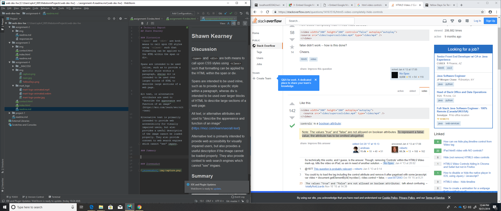

# Technical Report
## Shawn Kearney

### Discussion
`` and `
` are both means to call upon CSS styles using `<class>` such that formatting can be applied to the HTML within the span or div.

Spans are intended to be used inline, such as to provide a specific style within a paragraph, wheras div is intended to be used over larger blocks of HTML to describe large sections of a web page.

Alt text, or alternative attributes are used to "describe the appereance and function of an image" (https://moz.com/learn/seo/alt-text)

Alternative text is primarily intended to provide web accessibility for visually impaired users, but also provides a useful description if the image cannot be loaded properly. They also provide context to web search engines which cannot "see" imgaes.

### Summary

This week I spent a lot of time being unnecessarily intimidated. I thought this would be a lot more work, and a lot harder. To my suprise, when I finally got out of this slump, it wasn't nearly as bad as I thought and I've learned a bit about CSS that I had a difficult time understanding before.

I think the hardest party was to find a song that would be interesting to share :)

### Screenshot

