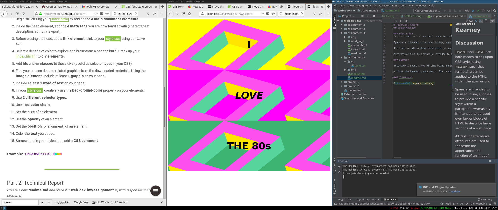

# Technical Report
## Shawn Kearney

### Discussion
I've spent a lot of time thinking about the 80s design style, and for a good portion of my young adulthood I enjoyed all things 80s. I am still a pretty big fan of 80s music, and so I am pretty familiar with the design aesthetic. I chose the funky 3D box thing not so much because it is representative of the decade in as much as the colors do.

San Serif fonts were popular in the 1980s. I'd use Bauhaus, but I don't think it is available.

The three colors I used were "yellow","fuchsia", "mediumseagreen" and "aqua"

### Summary
After chronic procrastination, I simply sat down, briefly reviewed the lecture material and followed the instructions through

I noticed that I missed the text color instruction, and looked up how to add an outline, which gave instructions for `text-shadow`, so I added some offset for extra pizzaz.

### Screenshot

