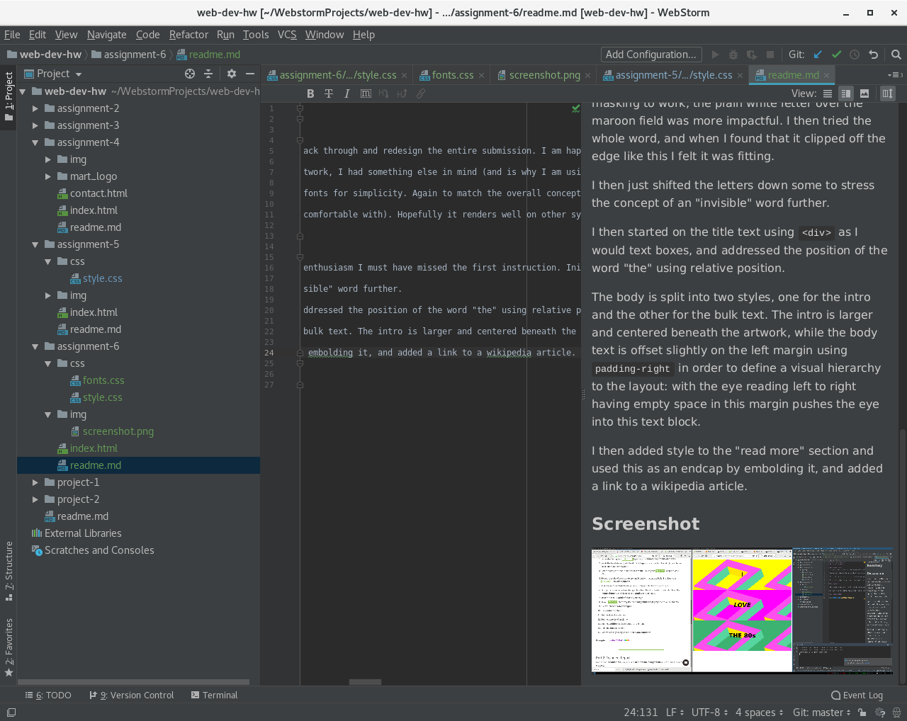

# Technical Report
## Shawn Kearney

### Discussion
I've overlooked step 1. And frankly, none really interest me enough to go back through and redesign the entire submission. I am happy with what I have produced here and stand by it, even if I am deducted points. Otherwise I believe all other criteria has been met.

I chose a Modern and minimal type style to match the word "the". For the artwork, I had something else in mind (and is why I am using masking) but I ended up really liking what it was doing conceptually for such an "ubiquitous and unassuming" word. I did not have time to go back through and change teh svg code, though I do not think it would be terribly problematic either.

The fonts I chose were simply 'Arial' and 'Times New Roman". I chose these fonts for simplicity. Again to match the overall concept.

I wanted to try approaching this website as I would print (which I am more comfortable with). Hopefully it renders well on other systems.

I still do not feel I have a good command over CSS.

### Summary
I came up with the concept of the website long before I started, and in my enthusiasm I must have missed the first instruction. Initially I wanted the artowrk to to be a T that masked out the word "THE", but after a bit of a struggle to get the css masking to work, the plain white letter over the maroon field was more impactful. I then tried the whole word, and when I found that it clipped off the edge like this I felt it was fitting.

I then just shifted the letters down some to stress the concept of an "invisible" word further.

I then started on the title text using `
` as I would text boxes, and addressed the position of the word "the" using relative position.

The body is split into two styles, one for the intro and the other for the bulk text. The intro is larger and centered beneath the artwork, while the body text is offset slightly on the left margin using `padding-right` in order to define a visual hierarchy to the layout: with the eye reading left to right having empty space in this margin pushes the eye into this text block.

I then added style to the "read more" section and used this as an endcap by embolding it, and added a link to a wikipedia article.

I thought I understood how to use semantic structure, though my attempt threw several errors and so I ended up removing all `alt` properties.
### Screenshot

