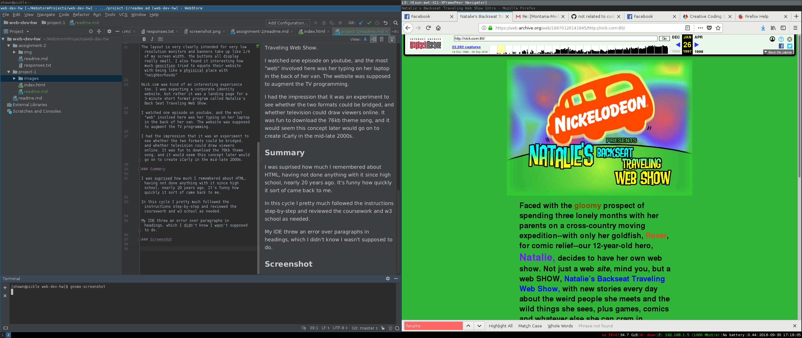

# Technical Report
## Shawn Kearney

### Web Browser Familiarity
I use the following web browsers on CentOS
* Firefox 60.2
* Vivaldi (chromium)
* Opera

I also use Google Chrome for Android

Web browsers interperit and display w3 standard documents, such as HTML, Java and CSS into web pages. They also request webpages from servers to be displayed.

### Wayback Machine
I had a lot of fun using the Wayback Machine website going as far back as I could. I looked up geocities.com and nick.com from 1996.

The websites were very basic and were more about information just being "pushed" at the audience. There wasn't any kind of interactive communication, aside from links and avertisements for "chat rooms". One advertisement on geocities forum was pretty fun, and advertised "free" services, that even includeed the chat service, implying that chat rooms were frequently premium, or that it was a response to AOL and Compuserve.

Another ad was trying to woo in hits with "free midi files of pop and rock songs"

The layout is very clearly intended for very low resolution monitors and banners take up like 1/4 of my screen width, the buttons all display really small. I also found it interesting how much geocities tried to equate their website with being like a phyisical place with "neighborhoods"

Nick.com was kind of an interesting experience too. I was expecting a corporate identity website, but rather it was a landing page for a 3-minute short format program called Natalie's Back Seat Traveling Web Show.

I watched one episode on youtube, and the most "web" involved here was her typing on her laptop in the back of her van. The website was supposed to augment the TV programming.

I had the impression that it was an experiment to see whether the two formats could be bridged, and whether television could draw viewers online. It was fun to download the 76kb theme song, and it would seem this concept later would go on to create iCarly in the mid-late 2000s.

### Summary

I was suprised how much I remembered about HTML, having not done anything with it since high school, nearly 20 years ago. It's funny how quickly it sort of came back to me.

In this cycle I pretty much followed the instructions step-by-step and reviewed the coursework and w3 school as needed.

My IDE threw an error over paragraphs in headings, which I didn't know I wasn't supposed to do.

### Screenshot

