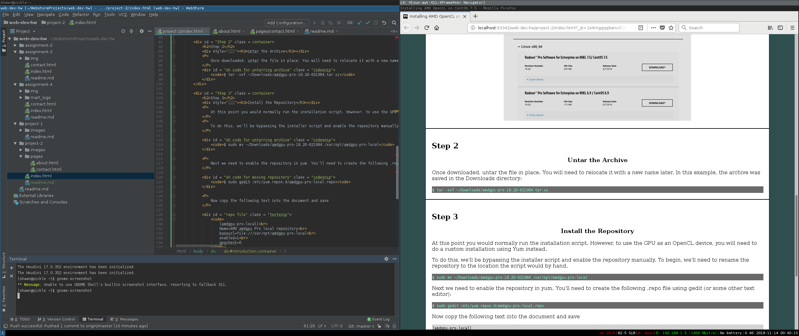

# Technical Report
## Shawn Kearney

I am still feeling a little bit shaky with HTML. I don't neccesarily feel confident that I am using best practices, and I suspect that my code is a bit messy. I think a better understanding of CSS will eventually help.

### Summary

I was a bit late starting this project primarily due to some personal complications, as a result I was late turning it in. I also had some trouble deciding on a topic, but ended up addressing a problem I had to resolve to get my AMD GPU that I bought specifically for compute to play nicely with my Nvidia display.

Overall, the experience feels messy. I don't like HTML mostly because it's so flexible it becomes extremely easy to write bad code - and I really feel like this project is pretty bad, but I am not sure how to better organize things. I think using CSS more will help me stay organized. 

I think i really prefer the forced structure of programming languages.
### Screenshot

