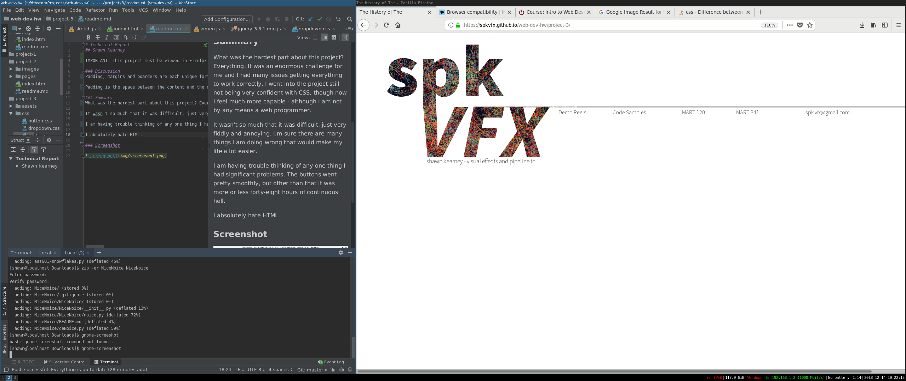

# Technical Report
## Shawn Kearney

IMPORTANT: This project must be viewed in Firefox. I need to work on a Chromium and Safari compatable version some other time.

### Discussion
Padding, margins and boarders are each unique formatting options that surround content.

Padding is the space between the content and the exterior border while the margin is the space outside and beyond the border. The border itself forms this boundary.

### Summary
What was the hardest part about this project? Everything. It was an enormous challenge for me and I had many issues getting everything to work correctly. I went into the project still not being very confident with CSS, though now I feel much more capable - although I am not by any means a web programmer.

It wasn't so much that it was difficult, just very fiddly and annoying. I;m sure there are many things I am doing wrong that would make my life a lot easier.

I am having trouble thinking of any one thing I had significant problems. The buttons went pretty smoothly, but other than that it was more or less forty-eight hours of continuous hell.

I absolutely hate HTML; though regardless of this I feel I do have something I can be proud of, and finally a webpage to submit for my graduate school application: provided that it renders properly and reliably. 

### Screenshot

